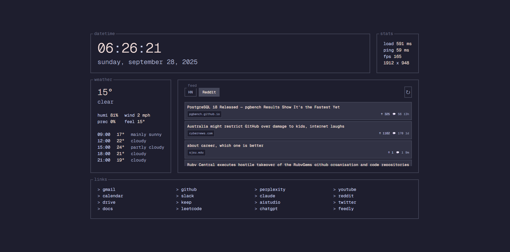

# re-started

A modern, customizable browser startpage built with Svelte. Features a clean TUI-style interface with task management, news feed, weather, and more.



## ✨ Features

### 🎯 **Core Functionality**
- **Task Management** - Local task system with due dates, notes, and completion tracking
- **News Feed** - Hacker News and Reddit integration with real-time updates
- **Weather Widget** - Current weather and 24h forecast using OpenMeteo API
- **Quick Links** - Customizable link collection with drag-and-drop organization
- **System Stats** - Load time, ping, FPS, and viewport size monitoring

### 🎨 **Customization**
- **Multiple Themes** - Catppuccin Mocha (default), Dark, Light, and Custom theme builder
- **Widget Selection** - Choose between Tasks or News Feed
- **Custom Colors** - Full theme customization with color picker
- **Responsive Design** - Works on all screen sizes
- **Backup & Restore** - Export/import all settings and data

### ⚡ **Performance**
- **Lightweight** - <90kb including fonts, loads in <50ms
- **No External Dependencies** - Pure Svelte with minimal footprint
- **Offline Capable** - Works without internet (except weather/news)

## 🚀 Quick Start

### Option 1: Live Demo
Visit the [live demo](https://start.f1sh.dev) to try it out immediately.

### Option 2: Self-Hosted
1. Clone this repository
2. Run `npm install`
3. Run `npm run dev` for development or `npm run build` for production
4. Deploy the `dist` folder to any static hosting service

## 📖 Usage Guide

### 🎛️ **Settings Panel**
- Hover over the top-right corner to reveal the settings button
- Configure themes, widgets, location, and more
- All settings are automatically saved locally

### 📝 **Task Management**
- **Add Tasks**: Use the settings panel to add new tasks
- **Complete Tasks**: Click the checkbox to mark as complete
- **Edit Tasks**: Click on task titles to edit inline
- **Delete Tasks**: Hover over tasks to reveal the delete button
- **Due Dates**: Set due dates and see overdue tasks highlighted

### 📰 **News Feed**
- **Switch Sources**: Toggle between Hacker News and Reddit
- **Auto Refresh**: Updates every 5 minutes automatically
- **External Links**: Click titles to open articles in new tabs
- **Compact View**: Optimized for quick scanning

### 🌤️ **Weather Widget**
- **Location**: Set your latitude/longitude in settings
- **Units**: Choose between Fahrenheit/Celsius and MPH/KMH
- **Forecast**: 24-hour weather forecast with hourly updates

### 💾 **Backup & Restore**
- **Export**: Download a complete backup of all your data
- **Import**: Upload a backup file to restore your settings
- **Drag & Drop**: Simply drag backup files onto the import area
- **Cross-Device**: Use backups to sync between devices


## 🛠️ **Development**

### Prerequisites
- Node.js 18+ 
- npm or yarn

### Setup
```bash
# Clone the repository
git clone https://github.com/yourusername/re-started.git
cd re-started

# Install dependencies
npm install

# Start development server
npm run dev

# Build for production
npm run build
```


### Self-Hosted
1. Build: `npm run build`
2. Upload `dist` contents to your web server
3. Configure your web server to serve `index.html` for all routes

## 📱 **Browser Support**

- ✅ Chrome 90+
- ✅ Firefox 88+
- ✅ Safari 14+
- ✅ Edge 90+

## 🤝 **Contributing**

Contributions are welcome! Please feel free to submit a Pull Request.

### Development Guidelines
1. Follow the existing code style
2. Add comments for complex logic
3. Test your changes thoroughly
4. Update documentation if needed

## 📄 **License**

This project is licensed under the MIT License - see the [LICENSE](LICENSE) file for details.

## 🙏 **Acknowledgments**

- [Svelte](https://svelte.dev/) - The amazing reactive framework
- [OpenMeteo](https://open-meteo.com/) - Free weather API
- [Hacker News API](https://github.com/HackerNews/API) - News data
- [Catppuccin](https://github.com/catppuccin/catppuccin) - Beautiful color palette

## 📞 **Support**

If you encounter any issues or have questions:

1. Check the [Issues](https://github.com/lostf1sh/re-started/issues) page
2. Create a new issue with detailed information
3. Join our community discussions

---

**Made by [refact0r](https://refact0r.dev), updated by [lostf1sh](https://f1sh.dev)**
